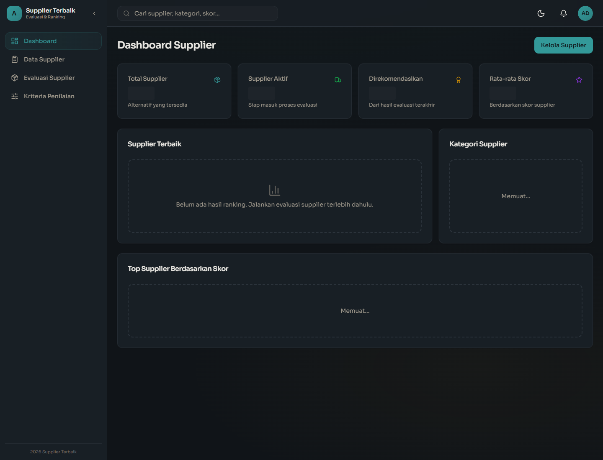
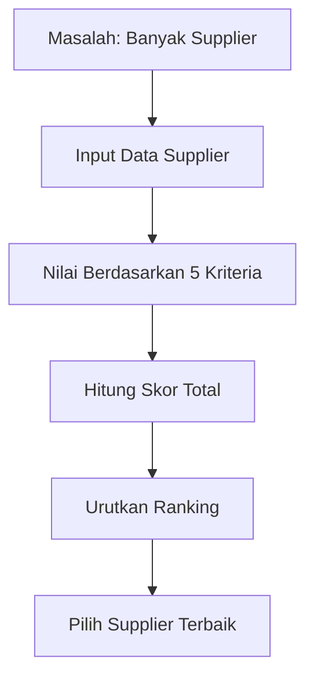
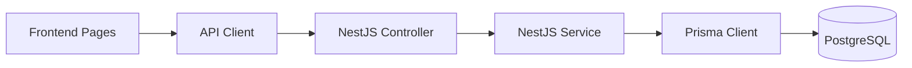
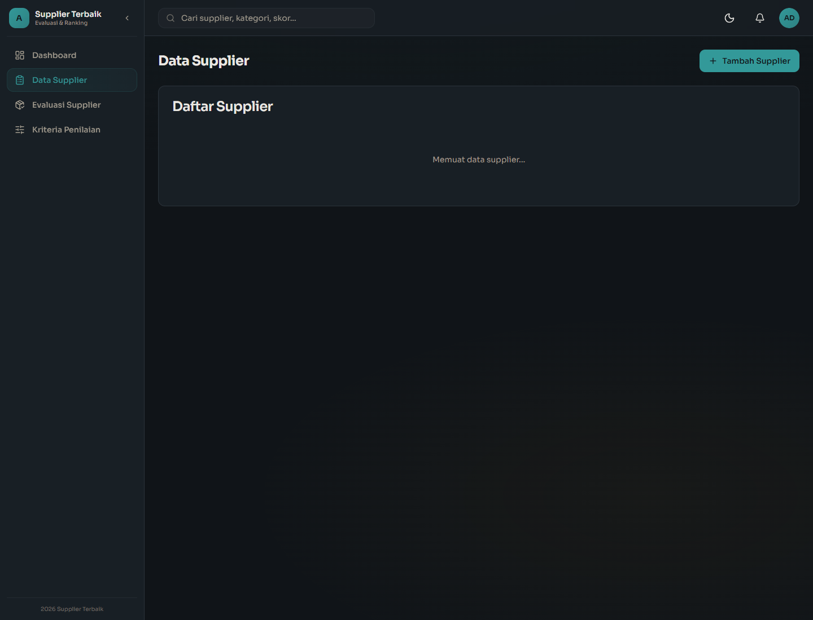
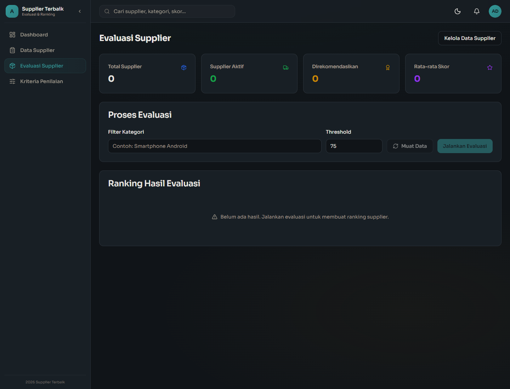
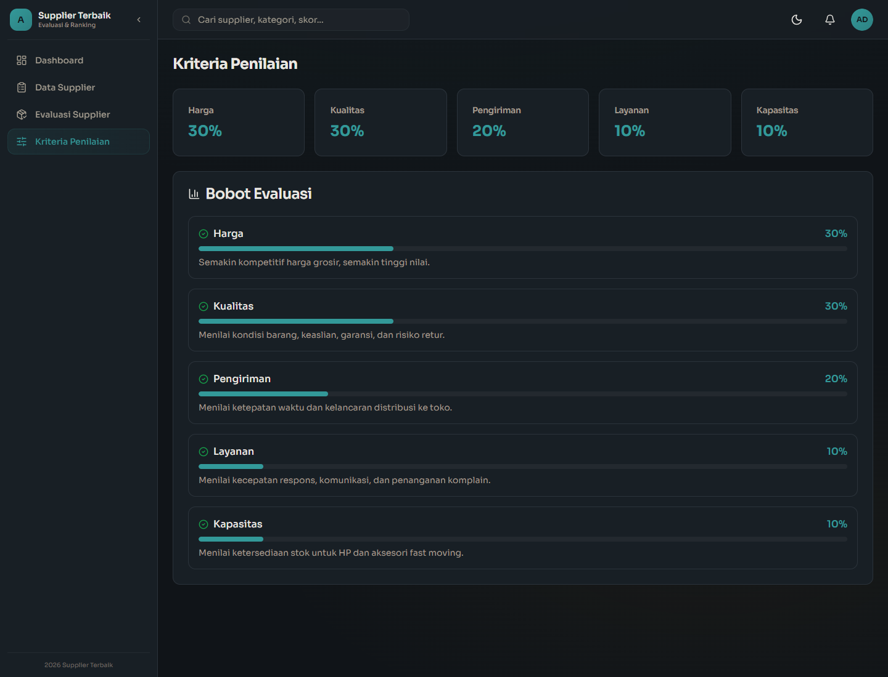
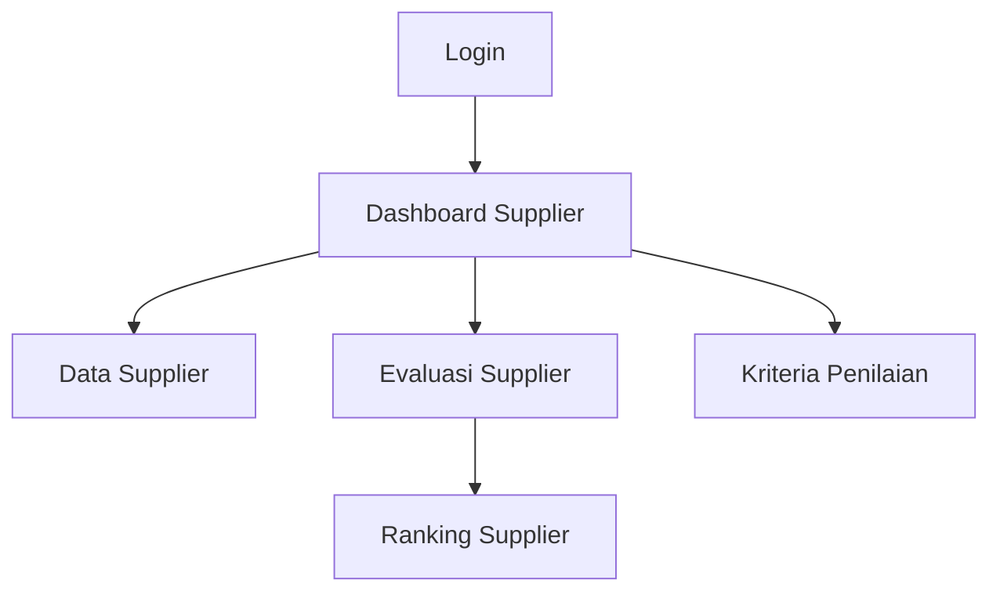

# Buku Panduan Aplikasi Pemilihan Supplier Terbaik

Versi: 1.0  
Bahasa: Indonesia  
Audiens: Mahasiswa IT yang belum pernah melihat project ini  
Format: Markdown siap dikonversi ke PDF

---

## Daftar Isi

1. [Pendahuluan](#1-pendahuluan)
2. [Instalasi & Setup](#2-instalasi--setup)
3. [Penjelasan Kode Per File](#3-penjelasan-kode-per-file)
4. [Cara Menjalankan](#4-cara-menjalankan)
5. [Hasil & Output](#5-hasil--output)

---

# 1. Pendahuluan

[GAMBAR: Tampilan awal aplikasi dengan sidebar berisi Dashboard, Data Supplier, Evaluasi Supplier, dan Kriteria Penilaian]



Aplikasi ini adalah sistem berbasis web untuk membantu CV Anugerah Mega Makmur memilih supplier terbaik. CV Anugerah Mega Makmur diasumsikan sebagai toko yang menjual barang elektronik seperti HP, aksesori HP, charger, powerbank, sparepart HP, audio gadget, dan produk teknologi lain.

Fokus utama aplikasi adalah:

- Menyimpan data supplier.
- Memberi skor supplier berdasarkan kriteria penilaian.
- Menghitung skor total supplier.
- Membuat ranking supplier terbaik.
- Menampilkan hasil evaluasi secara rapi untuk kebutuhan presentasi.

Istilah yang dipakai di UI adalah **Evaluasi Supplier**, bukan istilah teknis akademik, agar aplikasi terasa lebih natural untuk pengguna bisnis.

## 1.1 Tujuan Aplikasi



Diagram di atas menjelaskan proses utama aplikasi:

- Baris `flowchart TD` membuat diagram dari atas ke bawah.
- Node `A` menjelaskan masalah awal, yaitu banyaknya pilihan supplier.
- Node `B` menjelaskan bahwa data supplier dimasukkan ke sistem.
- Node `C` menjelaskan bahwa supplier dinilai berdasarkan kriteria.
- Node `D` menjelaskan proses hitung skor total.
- Node `E` menjelaskan proses sorting ranking.
- Node `F` adalah hasil akhir berupa supplier terbaik.

## 1.2 Kriteria Penilaian

[GAMBAR: Ilustrasi kartu bobot kriteria Harga 30%, Kualitas 30%, Pengiriman 20%, Layanan 10%, Kapasitas 10%]

Kriteria yang digunakan:

| Kriteria | Bobot | Alasan |
|---|---:|---|
| Harga | 30% | Toko perlu harga grosir kompetitif agar margin penjualan baik. |
| Kualitas | 30% | Barang elektronik harus asli, bagus, dan minim retur. |
| Pengiriman | 20% | Pengiriman cepat penting karena stok toko harus tersedia. |
| Layanan | 10% | Supplier harus responsif saat ada komplain atau permintaan stok. |
| Kapasitas | 10% | Supplier harus mampu memenuhi jumlah pesanan. |

Rumus skor total:

```text
totalScore = harga * 0.3 + kualitas * 0.3 + pengiriman * 0.2 + layanan * 0.1 + kapasitas * 0.1
```

Penjelasan baris per baris:

| Bagian | Penjelasan |
|---|---|
| `totalScore =` | Menyimpan hasil akhir perhitungan skor supplier. |
| `harga * 0.3` | Nilai harga dikalikan bobot 30%. |
| `kualitas * 0.3` | Nilai kualitas dikalikan bobot 30%. |
| `pengiriman * 0.2` | Nilai pengiriman dikalikan bobot 20%. |
| `layanan * 0.1` | Nilai layanan dikalikan bobot 10%. |
| `kapasitas * 0.1` | Nilai kapasitas dikalikan bobot 10%. |

---

# 2. Instalasi & Setup

[GAMBAR: Diagram setup project dari install dependency sampai aplikasi berjalan]

Project terdiri dari dua bagian:

- `backend/`: NestJS REST API, Prisma, PostgreSQL.
- `frontend/`: Next.js App Router, React, Tailwind, komponen UI.

## 2.1 Struktur Folder Utama

```text
spk_hris/
  backend/
  frontend/
  BUKU_PANDUAN_SUPPLIER.md
```

Penjelasan baris per baris:

| Baris | Penjelasan |
|---|---|
| `spk_hris/` | Folder root project. |
| `backend/` | Berisi API, Prisma schema, service, controller, dan seed data. |
| `frontend/` | Berisi halaman web, komponen, context auth, dan API client. |
| `BUKU_PANDUAN_SUPPLIER.md` | File buku panduan ini. |

## 2.2 Instalasi Dependency

```sh
npm install
cd backend
npm install
cd ../frontend
npm install
```

Penjelasan baris per baris:

| Baris | Penjelasan |
|---|---|
| `npm install` | Menginstal dependency root project, misalnya `concurrently`. |
| `cd backend` | Masuk ke folder backend. |
| `npm install` | Menginstal dependency NestJS, Prisma, JWT, dan library backend lain. |
| `cd ../frontend` | Berpindah dari backend ke frontend. |
| `npm install` | Menginstal dependency Next.js, React, Tailwind, dan komponen UI. |

## 2.3 Setup Database

```sh
cd backend
npm run prisma:migrate
npx ts-node prisma/seed-suppliers.ts
```

Penjelasan baris per baris:

| Baris | Penjelasan |
|---|---|
| `cd backend` | Semua command Prisma dijalankan dari folder backend. |
| `npm run prisma:migrate` | Menjalankan migration agar tabel database sesuai schema Prisma. |
| `npx ts-node prisma/seed-suppliers.ts` | Mengisi data supplier demo Pontianak untuk presentasi. |

---

# 3. Penjelasan Kode Per File

Bagian ini menjelaskan file kode yang membentuk fitur pemilihan supplier terbaik.



Penjelasan diagram:

- `UI` adalah halaman seperti Dashboard, Data Supplier, Evaluasi Supplier, dan Kriteria Penilaian.
- `API Client` adalah helper frontend untuk mengirim request HTTP.
- `Controller` menerima request di backend.
- `Service` menjalankan logika bisnis dan perhitungan.
- `Prisma Client` menghubungkan backend ke database.
- `PostgreSQL` menyimpan data supplier dan hasil evaluasi.

---

## 3.1 Backend: Model Database Supplier

[GAMBAR: ERD sederhana tabel Supplier dan SpkResult]

Model `Supplier` berada di `backend/prisma/schema.prisma`.

```prisma
model Supplier {
  id            Int      @id @default(autoincrement())
  name          String
  category      String
  contactPerson String?
  phone         String?
  address       String?
  priceScore    Decimal  @db.Decimal(5, 2)
  qualityScore  Decimal  @db.Decimal(5, 2)
  deliveryScore Decimal  @db.Decimal(5, 2)
  serviceScore  Decimal  @db.Decimal(5, 2)
  capacityScore Decimal  @db.Decimal(5, 2)
  totalScore    Decimal? @db.Decimal(5, 2)
  status        String   @default("ACTIVE")
  notes         String?
  createdAt     DateTime @default(now())
  updatedAt     DateTime @updatedAt

  @@map("suppliers")
}
```

Penjelasan baris per baris:

| Baris Kode | Penjelasan |
|---|---|
| `model Supplier {` | Membuka definisi model Prisma bernama `Supplier`. |
| `id Int @id @default(autoincrement())` | Kolom ID utama, otomatis bertambah. |
| `name String` | Nama supplier, wajib diisi. |
| `category String` | Kategori produk supplier, misalnya Smartphone Android. |
| `contactPerson String?` | Nama PIC supplier, opsional karena memakai tanda `?`. |
| `phone String?` | Nomor telepon supplier, opsional. |
| `address String?` | Alamat supplier, opsional. |
| `priceScore Decimal @db.Decimal(5, 2)` | Skor harga dengan presisi decimal. |
| `qualityScore Decimal @db.Decimal(5, 2)` | Skor kualitas barang. |
| `deliveryScore Decimal @db.Decimal(5, 2)` | Skor pengiriman. |
| `serviceScore Decimal @db.Decimal(5, 2)` | Skor layanan. |
| `capacityScore Decimal @db.Decimal(5, 2)` | Skor kapasitas stok. |
| `totalScore Decimal? @db.Decimal(5, 2)` | Skor akhir, opsional karena bisa belum dihitung. |
| `status String @default("ACTIVE")` | Status supplier, default `ACTIVE`. |
| `notes String?` | Catatan tambahan, opsional. |
| `createdAt DateTime @default(now())` | Waktu data dibuat otomatis. |
| `updatedAt DateTime @updatedAt` | Waktu data diperbarui otomatis. |
| `@@map("suppliers")` | Nama tabel fisik di database adalah `suppliers`. |
| `}` | Menutup model. |

Model `SpkResult` masih dipakai sebagai tabel hasil evaluasi.

```prisma
model SpkResult {
  id          Int      @id @default(autoincrement())
  type        String
  referenceId Int?
  employeeId  Int?
  score       Decimal  @db.Decimal(10, 4)
  rank        Int?
  details     Json?
  period      String?
  createdAt   DateTime @default(now())

  @@map("spk_results")
}
```

Penjelasan baris per baris:

| Baris Kode | Penjelasan |
|---|---|
| `model SpkResult {` | Membuka model untuk menyimpan hasil perhitungan. |
| `id Int @id @default(autoincrement())` | ID utama hasil evaluasi. |
| `type String` | Jenis hasil, untuk supplier memakai `SUPPLIER_SELECTION`. |
| `referenceId Int?` | ID referensi supplier. Opsional karena model lama juga dipakai untuk fitur lain. |
| `employeeId Int?` | Kolom lama untuk karyawan, tidak dipakai dalam fitur supplier. |
| `score Decimal @db.Decimal(10, 4)` | Skor akhir dengan presisi tinggi. |
| `rank Int?` | Urutan ranking supplier. |
| `details Json?` | Detail hasil disimpan sebagai JSON fleksibel. |
| `period String?` | Periode hasil, opsional. |
| `createdAt DateTime @default(now())` | Waktu hasil dibuat. |
| `@@map("spk_results")` | Nama tabel database adalah `spk_results`. |
| `}` | Menutup model. |

---

## 3.2 Backend: DTO Supplier

[GAMBAR: Ilustrasi validasi request dari frontend ke backend]

File: `backend/src/spk/dto/create-spk.dto.ts`

DTO adalah class yang menentukan bentuk data request dan aturan validasi.

### 3.2.1 Import Library Validasi

```ts
import { Type } from 'class-transformer';
import { IsOptional, IsNumber, Min, Max, IsString } from 'class-validator';
```

Penjelasan baris per baris:

| Baris | Penjelasan |
|---|---|
| `import { Type } from 'class-transformer';` | Mengambil decorator `Type` untuk mengubah tipe data, misalnya string menjadi number. |
| `import { IsOptional, IsNumber, Min, Max, IsString } from 'class-validator';` | Mengambil validator untuk mengecek field opsional, angka, batas minimum, batas maksimum, dan string. |

### 3.2.2 DTO Menjalankan Evaluasi Supplier

```ts
export class RunSupplierSelectionDto {
  @IsOptional()
  @Type(() => Number)
  @IsNumber()
  @Min(0)
  @Max(100)
  threshold?: number;

  @IsOptional()
  @IsString()
  category?: string;
}
```

Penjelasan baris per baris:

| Baris Kode | Penjelasan |
|---|---|
| `export class RunSupplierSelectionDto {` | Membuat class DTO untuk request menjalankan evaluasi supplier. |
| `@IsOptional()` | Field `threshold` boleh tidak dikirim. |
| `@Type(() => Number)` | Mengubah nilai `threshold` menjadi number. |
| `@IsNumber()` | Memastikan `threshold` adalah angka. |
| `@Min(0)` | Nilai minimal threshold adalah 0. |
| `@Max(100)` | Nilai maksimal threshold adalah 100. |
| `threshold?: number;` | Field threshold bertipe number dan opsional. |
| `@IsOptional()` | Field `category` boleh tidak dikirim. |
| `@IsString()` | Jika dikirim, category harus string. |
| `category?: string;` | Field kategori supplier untuk filter. |
| `}` | Menutup class DTO. |

### 3.2.3 DTO Membuat Supplier

```ts
export class CreateSupplierDto {
  @IsString()
  name: string;

  @IsString()
  category: string;

  @IsOptional()
  @IsString()
  contactPerson?: string;

  @IsOptional()
  @IsString()
  phone?: string;

  @IsOptional()
  @IsString()
  address?: string;
}
```

Penjelasan baris per baris:

| Baris Kode | Penjelasan |
|---|---|
| `export class CreateSupplierDto {` | Membuka DTO untuk membuat supplier baru. |
| `@IsString()` sebelum `name` | Nama supplier wajib berupa string. |
| `name: string;` | Field nama supplier. |
| `@IsString()` sebelum `category` | Kategori wajib berupa string. |
| `category: string;` | Field kategori supplier. |
| `@IsOptional()` sebelum `contactPerson` | PIC boleh kosong. |
| `@IsString()` sebelum `contactPerson` | Jika PIC diisi, harus string. |
| `contactPerson?: string;` | Field PIC supplier. |
| `@IsOptional()` sebelum `phone` | Telepon boleh kosong. |
| `@IsString()` sebelum `phone` | Jika diisi, telepon harus string. |
| `phone?: string;` | Field nomor telepon. |
| `@IsOptional()` sebelum `address` | Alamat boleh kosong. |
| `@IsString()` sebelum `address` | Jika diisi, alamat harus string. |
| `address?: string;` | Field alamat supplier. |
| `}` | Menutup class. |

Field skor pada `CreateSupplierDto`:

```ts
@Type(() => Number)
@IsNumber()
@Min(0)
@Max(100)
priceScore: number;
```

Penjelasan baris per baris:

| Baris Kode | Penjelasan |
|---|---|
| `@Type(() => Number)` | Mengubah input menjadi angka. |
| `@IsNumber()` | Memastikan nilai adalah angka. |
| `@Min(0)` | Skor minimal 0. |
| `@Max(100)` | Skor maksimal 100. |
| `priceScore: number;` | Skor harga supplier. |

Pola yang sama dipakai untuk:

- `qualityScore`: skor kualitas.
- `deliveryScore`: skor pengiriman.
- `serviceScore`: skor layanan.
- `capacityScore`: skor kapasitas.

### 3.2.4 DTO Update Supplier

```ts
export class UpdateSupplierDto {
  @IsOptional()
  @IsString()
  name?: string;
}
```

Penjelasan baris per baris:

| Baris Kode | Penjelasan |
|---|---|
| `export class UpdateSupplierDto {` | Membuka DTO untuk memperbarui supplier. |
| `@IsOptional()` | Field boleh tidak dikirim saat update. |
| `@IsString()` | Jika dikirim, field harus string. |
| `name?: string;` | Nama supplier opsional saat update. |
| `}` | Menutup class. |

Semua field update dibuat opsional agar user dapat mengubah sebagian data saja.

---

## 3.3 Backend: Controller Supplier

[GAMBAR: Flow request HTTP menuju controller]

File: `backend/src/spk/spk.controller.ts`

Controller bertugas menerima request dari frontend dan meneruskannya ke service.

### 3.3.1 Import Controller

```ts
import { Controller, Get, Post, Patch, Delete, Body, Param, Query, ParseIntPipe, UseGuards } from '@nestjs/common';
```

Penjelasan baris per baris:

| Bagian | Penjelasan |
|---|---|
| `Controller` | Decorator untuk membuat class sebagai controller NestJS. |
| `Get` | Decorator endpoint HTTP GET. |
| `Post` | Decorator endpoint HTTP POST. |
| `Patch` | Decorator endpoint HTTP PATCH. |
| `Delete` | Decorator endpoint HTTP DELETE. |
| `Body` | Mengambil body request. |
| `Param` | Mengambil parameter URL. |
| `Query` | Mengambil query string. |
| `ParseIntPipe` | Mengubah parameter string menjadi number. |
| `UseGuards` | Memasang guard keamanan. |

### 3.3.2 Decorator Controller

```ts
@ApiTags('SPK')
@ApiBearerAuth()
@UseGuards(JwtAuthGuard, RolesGuard)
@Controller('spk')
export class SpkController {
  constructor(private service: SpkService) {}
}
```

Penjelasan baris per baris:

| Baris Kode | Penjelasan |
|---|---|
| `@ApiTags('SPK')` | Mengelompokkan endpoint di Swagger. Nama teknis masih SPK. |
| `@ApiBearerAuth()` | Menandakan endpoint memakai token Bearer JWT. |
| `@UseGuards(JwtAuthGuard, RolesGuard)` | Memaksa user login dan dicek role-nya. |
| `@Controller('spk')` | Semua route controller diawali `/spk`. |
| `export class SpkController {` | Membuka class controller. |
| `constructor(private service: SpkService) {}` | Menyuntikkan service agar controller bisa memanggil logika bisnis. |
| `}` | Menutup class. |

### 3.3.3 Endpoint Daftar Supplier

```ts
@Get('suppliers')
@Roles('SUPER_ADMIN', 'ADMIN_HR', 'MANAGER')
@ApiOperation({ summary: 'Get supplier alternatives for SPK' })
getSuppliers(@Query('category') category?: string) {
  return this.service.getSuppliers(category);
}
```

Penjelasan baris per baris:

| Baris Kode | Penjelasan |
|---|---|
| `@Get('suppliers')` | Membuat endpoint GET `/api/spk/suppliers`. |
| `@Roles(...)` | Membatasi akses ke SUPER_ADMIN, ADMIN_HR, dan MANAGER. |
| `@ApiOperation(...)` | Menulis deskripsi endpoint di Swagger. |
| `getSuppliers(@Query('category') category?: string) {` | Method menerima query opsional `category`. |
| `return this.service.getSuppliers(category);` | Memanggil service untuk mengambil data supplier. |
| `}` | Menutup method. |

### 3.3.4 Endpoint Tambah Supplier

```ts
@Post('suppliers')
@Roles('SUPER_ADMIN', 'ADMIN_HR')
createSupplier(@Body() dto: CreateSupplierDto) {
  return this.service.createSupplier(dto);
}
```

Penjelasan baris per baris:

| Baris Kode | Penjelasan |
|---|---|
| `@Post('suppliers')` | Membuat endpoint POST `/api/spk/suppliers`. |
| `@Roles('SUPER_ADMIN', 'ADMIN_HR')` | Hanya admin yang boleh menambah supplier. |
| `createSupplier(@Body() dto: CreateSupplierDto) {` | Body request divalidasi memakai DTO. |
| `return this.service.createSupplier(dto);` | Data dikirim ke service untuk disimpan. |
| `}` | Menutup method. |

### 3.3.5 Endpoint Update Supplier

```ts
@Patch('suppliers/:id')
@Roles('SUPER_ADMIN', 'ADMIN_HR')
updateSupplier(@Param('id', ParseIntPipe) id: number, @Body() dto: UpdateSupplierDto) {
  return this.service.updateSupplier(id, dto);
}
```

Penjelasan baris per baris:

| Baris Kode | Penjelasan |
|---|---|
| `@Patch('suppliers/:id')` | Membuat endpoint PATCH dengan parameter ID. |
| `@Roles(...)` | Hanya admin yang boleh update. |
| `@Param('id', ParseIntPipe) id: number` | Mengambil `id` dari URL dan mengubahnya menjadi number. |
| `@Body() dto: UpdateSupplierDto` | Mengambil data update dari body. |
| `return this.service.updateSupplier(id, dto);` | Memanggil service update supplier. |
| `}` | Menutup method. |

### 3.3.6 Endpoint Hapus Supplier

```ts
@Delete('suppliers/:id')
@Roles('SUPER_ADMIN', 'ADMIN_HR')
deleteSupplier(@Param('id', ParseIntPipe) id: number) {
  return this.service.deleteSupplier(id);
}
```

Penjelasan baris per baris:

| Baris Kode | Penjelasan |
|---|---|
| `@Delete('suppliers/:id')` | Membuat endpoint DELETE supplier berdasarkan ID. |
| `@Roles(...)` | Hanya admin yang boleh menghapus. |
| `deleteSupplier(...)` | Method controller untuk hapus supplier. |
| `@Param('id', ParseIntPipe) id: number` | Mengambil ID dan mengubahnya menjadi number. |
| `return this.service.deleteSupplier(id);` | Meminta service menghapus supplier. |
| `}` | Menutup method. |

### 3.3.7 Endpoint Jalankan Evaluasi

```ts
@Post('supplier-selection')
@Roles('SUPER_ADMIN', 'ADMIN_HR', 'MANAGER')
runSupplierSelection(@Body() dto: RunSupplierSelectionDto) {
  return this.service.supplierSelection(dto.category, dto.threshold);
}
```

Penjelasan baris per baris:

| Baris Kode | Penjelasan |
|---|---|
| `@Post('supplier-selection')` | Membuat endpoint POST untuk menjalankan evaluasi supplier. |
| `@Roles(...)` | SUPER_ADMIN, ADMIN_HR, dan MANAGER boleh menjalankan evaluasi. |
| `runSupplierSelection(@Body() dto: RunSupplierSelectionDto) {` | Menerima request berupa kategori dan threshold. |
| `return this.service.supplierSelection(dto.category, dto.threshold);` | Memanggil service perhitungan dan ranking. |
| `}` | Menutup method. |

---

## 3.4 Backend: Service Supplier

[GAMBAR: Diagram service menghitung skor dan menyimpan ranking]

File: `backend/src/spk/spk.service.ts`

Service adalah tempat logika bisnis utama.

### 3.4.1 Fungsi Hitung Skor Supplier

```ts
private calculateSupplierScore(supplier: {
  priceScore: unknown;
  qualityScore: unknown;
  deliveryScore: unknown;
  serviceScore: unknown;
  capacityScore: unknown;
}) {
  const total =
    Number(supplier.priceScore) * 0.3 +
    Number(supplier.qualityScore) * 0.3 +
    Number(supplier.deliveryScore) * 0.2 +
    Number(supplier.serviceScore) * 0.1 +
    Number(supplier.capacityScore) * 0.1;

  return Math.round(total * 100) / 100;
}
```

Penjelasan baris per baris:

| Baris Kode | Penjelasan |
|---|---|
| `private calculateSupplierScore(...)` | Membuat method private untuk menghitung skor supplier. |
| `supplier: { ... }` | Parameter berupa object yang memiliki lima skor. |
| `priceScore: unknown;` | Skor harga diterima sebagai unknown agar fleksibel dari Prisma atau DTO. |
| `qualityScore: unknown;` | Skor kualitas. |
| `deliveryScore: unknown;` | Skor pengiriman. |
| `serviceScore: unknown;` | Skor layanan. |
| `capacityScore: unknown;` | Skor kapasitas. |
| `const total =` | Membuat variabel total skor. |
| `Number(supplier.priceScore) * 0.3 +` | Mengubah skor harga menjadi number lalu dikali bobot 30%. |
| `Number(supplier.qualityScore) * 0.3 +` | Mengubah skor kualitas menjadi number lalu dikali bobot 30%. |
| `Number(supplier.deliveryScore) * 0.2 +` | Mengubah skor pengiriman menjadi number lalu dikali bobot 20%. |
| `Number(supplier.serviceScore) * 0.1 +` | Mengubah skor layanan menjadi number lalu dikali bobot 10%. |
| `Number(supplier.capacityScore) * 0.1;` | Mengubah skor kapasitas menjadi number lalu dikali bobot 10%. |
| `return Math.round(total * 100) / 100;` | Membulatkan skor menjadi dua angka desimal. |
| `}` | Menutup method. |

### 3.4.2 Ambil Daftar Supplier

```ts
async getSuppliers(category?: string) {
  return this.prisma.supplier.findMany({
    where: {
      ...(category ? { category: { contains: category, mode: 'insensitive' as const } } : {}),
    },
    orderBy: [{ totalScore: 'desc' }, { name: 'asc' }],
  });
}
```

Penjelasan baris per baris:

| Baris Kode | Penjelasan |
|---|---|
| `async getSuppliers(category?: string) {` | Method async untuk mengambil supplier, category opsional. |
| `return this.prisma.supplier.findMany({` | Mengambil banyak data supplier dari database. |
| `where: {` | Bagian filter query. |
| `...(category ? ... : {})` | Jika category ada, tambahkan filter; jika tidak, filter kosong. |
| `contains: category` | Mencari supplier yang kategorinya mengandung teks tertentu. |
| `mode: 'insensitive' as const` | Pencarian tidak membedakan huruf besar/kecil. |
| `orderBy: [{ totalScore: 'desc' }, { name: 'asc' }]` | Urutkan skor tertinggi lalu nama A-Z. |
| `});` | Menutup query Prisma. |
| `}` | Menutup method. |

### 3.4.3 Membuat Supplier

```ts
async createSupplier(data: CreateSupplierDto) {
  return this.prisma.supplier.create({
    data: this.supplierPayload(data) as CreateSupplierDto & { totalScore: number },
  });
}
```

Penjelasan baris per baris:

| Baris Kode | Penjelasan |
|---|---|
| `async createSupplier(data: CreateSupplierDto) {` | Method async menerima data supplier baru. |
| `return this.prisma.supplier.create({` | Membuat record supplier di database. |
| `data: this.supplierPayload(data) ...` | Data diproses dulu agar totalScore otomatis dihitung. |
| `as CreateSupplierDto & { totalScore: number }` | Type assertion agar TypeScript tahu data punya totalScore. |
| `});` | Menutup create Prisma. |
| `}` | Menutup method. |

### 3.4.4 Update Supplier

```ts
async updateSupplier(id: number, data: UpdateSupplierDto) {
  const existing = await this.prisma.supplier.findUnique({ where: { id } });
  if (!existing) throw new NotFoundException('Supplier not found');
}
```

Penjelasan baris per baris:

| Baris Kode | Penjelasan |
|---|---|
| `async updateSupplier(id: number, data: UpdateSupplierDto) {` | Method update menerima ID dan data baru. |
| `const existing = await this.prisma.supplier.findUnique({ where: { id } });` | Mencari supplier berdasarkan ID. |
| `if (!existing)` | Mengecek apakah supplier tidak ditemukan. |
| `throw new NotFoundException('Supplier not found');` | Mengirim error 404 jika supplier tidak ada. |
| `}` | Menutup potongan awal method. |

Lanjutan update:

```ts
const merged = {
  priceScore: data.priceScore ?? Number(existing.priceScore),
  qualityScore: data.qualityScore ?? Number(existing.qualityScore),
  deliveryScore: data.deliveryScore ?? Number(existing.deliveryScore),
  serviceScore: data.serviceScore ?? Number(existing.serviceScore),
  capacityScore: data.capacityScore ?? Number(existing.capacityScore),
};
```

Penjelasan baris per baris:

| Baris Kode | Penjelasan |
|---|---|
| `const merged = {` | Membuat object gabungan skor lama dan skor baru. |
| `priceScore: data.priceScore ?? Number(existing.priceScore),` | Jika skor harga baru ada, pakai itu; jika tidak, pakai skor lama. |
| `qualityScore: data.qualityScore ?? Number(existing.qualityScore),` | Prinsip sama untuk kualitas. |
| `deliveryScore: data.deliveryScore ?? Number(existing.deliveryScore),` | Prinsip sama untuk pengiriman. |
| `serviceScore: data.serviceScore ?? Number(existing.serviceScore),` | Prinsip sama untuk layanan. |
| `capacityScore: data.capacityScore ?? Number(existing.capacityScore),` | Prinsip sama untuk kapasitas. |
| `};` | Menutup object. |

Bagian simpan update:

```ts
return this.prisma.supplier.update({
  where: { id },
  data: {
    ...data,
    totalScore: this.calculateSupplierScore(merged),
  },
});
```

Penjelasan baris per baris:

| Baris Kode | Penjelasan |
|---|---|
| `return this.prisma.supplier.update({` | Mengupdate data supplier di database. |
| `where: { id },` | Supplier yang diupdate adalah supplier dengan ID tersebut. |
| `data: {` | Bagian data baru. |
| `...data,` | Menyalin semua field update dari request. |
| `totalScore: this.calculateSupplierScore(merged),` | Menghitung ulang total skor setelah update. |
| `},` | Menutup data. |
| `});` | Menutup query update. |

### 3.4.5 Hapus Supplier

```ts
async deleteSupplier(id: number) {
  const existing = await this.prisma.supplier.findUnique({ where: { id } });
  if (!existing) throw new NotFoundException('Supplier not found');
  await this.prisma.supplier.delete({ where: { id } });
  return { id };
}
```

Penjelasan baris per baris:

| Baris Kode | Penjelasan |
|---|---|
| `async deleteSupplier(id: number) {` | Method async untuk menghapus supplier. |
| `const existing = ...` | Mencari supplier terlebih dahulu. |
| `if (!existing)` | Mengecek jika supplier tidak ada. |
| `throw new NotFoundException(...)` | Mengirim error 404. |
| `await this.prisma.supplier.delete({ where: { id } });` | Menghapus supplier dari database. |
| `return { id };` | Mengembalikan ID supplier yang dihapus. |
| `}` | Menutup method. |

### 3.4.6 Proses Evaluasi Supplier

```ts
async supplierSelection(category?: string, threshold = 75) {
  const suppliers = await this.prisma.supplier.findMany({
    where: {
      status: 'ACTIVE',
      ...(category ? { category: { contains: category, mode: 'insensitive' as const } } : {}),
    },
  });
}
```

Penjelasan baris per baris:

| Baris Kode | Penjelasan |
|---|---|
| `async supplierSelection(category?: string, threshold = 75) {` | Method untuk menjalankan evaluasi supplier. Threshold default 75. |
| `const suppliers = await this.prisma.supplier.findMany({` | Mengambil data supplier dari database. |
| `where: {` | Filter query. |
| `status: 'ACTIVE',` | Hanya supplier aktif yang dinilai. |
| `...(category ? ... : {})` | Jika kategori diisi, hasil difilter berdasarkan kategori. |
| `},` | Menutup filter. |
| `});` | Menutup query. |
| `}` | Menutup potongan method. |

Bagian ranking:

```ts
const results = suppliers
  .map((supplier) => {
    const totalScore = this.calculateSupplierScore(supplier);
    return { supplierId: supplier.id, name: supplier.name, totalScore, recommended: totalScore >= threshold, rank: 0 };
  })
  .sort((a, b) => b.totalScore - a.totalScore)
  .map((supplier, index) => ({ ...supplier, rank: index + 1 }));
```

Penjelasan baris per baris:

| Baris Kode | Penjelasan |
|---|---|
| `const results = suppliers` | Memulai transformasi data supplier menjadi hasil evaluasi. |
| `.map((supplier) => {` | Mengubah setiap supplier menjadi object hasil. |
| `const totalScore = this.calculateSupplierScore(supplier);` | Menghitung skor supplier. |
| `return { ... }` | Mengembalikan data hasil supplier. |
| `supplierId: supplier.id` | Menyimpan ID supplier. |
| `name: supplier.name` | Menyimpan nama supplier. |
| `totalScore` | Menyimpan total skor. |
| `recommended: totalScore >= threshold` | Supplier direkomendasikan jika skor memenuhi threshold. |
| `rank: 0` | Nilai awal ranking sebelum sorting. |
| `.sort((a, b) => b.totalScore - a.totalScore)` | Mengurutkan skor tertinggi ke terendah. |
| `.map((supplier, index) => ({ ...supplier, rank: index + 1 }))` | Memberi ranking mulai dari 1. |

---

## 3.5 Backend: Seed Data Supplier Pontianak

[GAMBAR: Tabel data demo supplier Pontianak untuk presentasi]

File: `backend/prisma/seed-suppliers.ts`

### 3.5.1 Inisialisasi Prisma

```ts
import { PrismaClient } from '@prisma/client';

const prisma = new PrismaClient();
```

Penjelasan baris per baris:

| Baris Kode | Penjelasan |
|---|---|
| `import { PrismaClient } from '@prisma/client';` | Mengambil Prisma Client untuk akses database. |
| `const prisma = new PrismaClient();` | Membuat instance Prisma Client. |

### 3.5.2 Tipe Data Supplier Seed

```ts
type SupplierSeed = {
  name: string;
  category: string;
  contactPerson: string;
  phone: string;
  address: string;
  priceScore: number;
  qualityScore: number;
  deliveryScore: number;
  serviceScore: number;
  capacityScore: number;
  notes: string;
};
```

Penjelasan baris per baris:

| Baris Kode | Penjelasan |
|---|---|
| `type SupplierSeed = {` | Membuat tipe TypeScript untuk data supplier dummy. |
| `name: string;` | Nama supplier. |
| `category: string;` | Kategori produk. |
| `contactPerson: string;` | PIC supplier. |
| `phone: string;` | Nomor telepon. |
| `address: string;` | Alamat supplier. |
| `priceScore: number;` | Skor harga. |
| `qualityScore: number;` | Skor kualitas. |
| `deliveryScore: number;` | Skor pengiriman. |
| `serviceScore: number;` | Skor layanan. |
| `capacityScore: number;` | Skor kapasitas. |
| `notes: string;` | Catatan presentasi. |
| `};` | Menutup definisi type. |

### 3.5.3 Data Demo Supplier

```ts
const suppliers: SupplierSeed[] = [
  {
    name: 'Pontianak Mobile Grosir',
    category: 'Smartphone Android',
    contactPerson: 'Andi Saputra',
    phone: '0812-5600-1101',
    address: 'Jl. Gajah Mada, Pontianak Kota, Kalimantan Barat',
    priceScore: 91,
    qualityScore: 90,
    deliveryScore: 88,
    serviceScore: 86,
    capacityScore: 92,
    notes: 'Stok HP Android stabil, cocok untuk pembelian grosir toko elektronik.',
  },
];
```

Penjelasan baris per baris:

| Baris Kode | Penjelasan |
|---|---|
| `const suppliers: SupplierSeed[] = [` | Membuat array supplier dengan tipe `SupplierSeed`. |
| `{` | Membuka object supplier pertama. |
| `name: 'Pontianak Mobile Grosir'` | Nama supplier demo. |
| `category: 'Smartphone Android'` | Supplier menjual HP Android. |
| `contactPerson: 'Andi Saputra'` | Nama PIC supplier. |
| `phone: '0812-5600-1101'` | Nomor kontak dummy untuk presentasi. |
| `address: ...` | Alamat di area Pontianak. |
| `priceScore: 91` | Skor harga tinggi. |
| `qualityScore: 90` | Skor kualitas tinggi. |
| `deliveryScore: 88` | Skor pengiriman baik. |
| `serviceScore: 86` | Skor layanan baik. |
| `capacityScore: 92` | Kapasitas stok sangat baik. |
| `notes: ...` | Catatan mengapa supplier relevan. |
| `},` | Menutup object supplier. |
| `];` | Menutup array supplier. |

Data lengkap berisi 10 supplier simulasi realistis area Pontianak:

| Supplier | Kategori | Skor |
|---|---|---:|
| Pontianak Mobile Grosir | Smartphone Android | 89.70 |
| Ayani Digital Wholesale | Gadget Grosir | 89.50 |
| Khatulistiwa Gadget Supply | Smartphone & Tablet | 89.40 |
| Mega Jaya Cellular Pontianak | Smartphone Android | 89.10 |
| Kapuas Aksesoris Cell | Aksesori HP | 88.00 |
| Borneo Tech Distributor | Aksesori Premium | 87.30 |
| Mandiri Charger & Powerbank | Charger & Powerbank | 87.20 |
| Sungai Raya Gadget Partner | Smartphone & Aksesori | 87.00 |
| Equator Phone Parts | Sparepart HP | 86.20 |
| Nusantara Audio Gadget | Audio & Wearable | 84.60 |

### 3.5.4 Fungsi Hitung Skor Seed

```ts
function supplierScore(supplier: SupplierSeed) {
  return Number((
    supplier.priceScore * 0.3 +
    supplier.qualityScore * 0.3 +
    supplier.deliveryScore * 0.2 +
    supplier.serviceScore * 0.1 +
    supplier.capacityScore * 0.1
  ).toFixed(2));
}
```

Penjelasan baris per baris:

| Baris Kode | Penjelasan |
|---|---|
| `function supplierScore(...)` | Membuat fungsi untuk menghitung skor supplier dummy. |
| `return Number((` | Mengembalikan hasil sebagai number. |
| `supplier.priceScore * 0.3 +` | Harga dikali bobot 30%. |
| `supplier.qualityScore * 0.3 +` | Kualitas dikali bobot 30%. |
| `supplier.deliveryScore * 0.2 +` | Pengiriman dikali bobot 20%. |
| `supplier.serviceScore * 0.1 +` | Layanan dikali bobot 10%. |
| `supplier.capacityScore * 0.1` | Kapasitas dikali bobot 10%. |
| `).toFixed(2));` | Membulatkan ke dua desimal. |
| `}` | Menutup fungsi. |

---

## 3.6 Frontend: Sidebar

[GAMBAR: Sidebar aplikasi dengan empat menu minimal]


File: `frontend/src/components/sidebar.tsx`

### 3.6.1 Import Sidebar

```tsx
import Link from "next/link"
import { usePathname } from "next/navigation"
import { ClipboardList, LayoutDashboard, PackageCheck, SlidersHorizontal, ChevronLeft, ChevronRight } from "lucide-react"
```

Penjelasan baris per baris:

| Baris Kode | Penjelasan |
|---|---|
| `import Link from "next/link"` | Komponen navigasi internal Next.js. |
| `import { usePathname } from "next/navigation"` | Hook untuk mengetahui route aktif. |
| `import { ... } from "lucide-react"` | Mengambil icon yang dipakai sidebar. |

### 3.6.2 Daftar Menu

```tsx
const menuItems = [
  { icon: LayoutDashboard, label: "Dashboard", href: "/", roles: [ROLES.SUPER_ADMIN, ROLES.ADMIN_HR, ROLES.MANAGER, ROLES.KARYAWAN] },
  { icon: ClipboardList, label: "Data Supplier", href: "/suppliers", roles: [ROLES.SUPER_ADMIN, ROLES.ADMIN_HR, ROLES.MANAGER] },
  { icon: PackageCheck, label: "Evaluasi Supplier", href: "/spk", roles: [ROLES.SUPER_ADMIN, ROLES.ADMIN_HR, ROLES.MANAGER] },
  { icon: SlidersHorizontal, label: "Kriteria Penilaian", href: "/criteria", roles: [ROLES.SUPER_ADMIN, ROLES.ADMIN_HR, ROLES.MANAGER, ROLES.KARYAWAN] },
]
```

Penjelasan baris per baris:

| Baris Kode | Penjelasan |
|---|---|
| `const menuItems = [` | Membuat array konfigurasi menu sidebar. |
| `Dashboard` | Menu halaman ringkasan supplier. |
| `Data Supplier` | Menu CRUD supplier. |
| `Evaluasi Supplier` | Menu proses perhitungan dan ranking. |
| `Kriteria Penilaian` | Menu penjelasan bobot kriteria. |
| `href` | Route tujuan menu. |
| `roles` | Role yang boleh melihat menu tersebut. |
| `]` | Menutup array menu. |

### 3.6.3 Filter Menu Berdasarkan Role

```tsx
const visibleItems = menuItems.filter((item) => (user?.role ? item.roles.includes(user.role as Role) : true))
```

Penjelasan baris per baris:

| Bagian | Penjelasan |
|---|---|
| `const visibleItems =` | Menyimpan menu yang boleh tampil. |
| `menuItems.filter(...)` | Memfilter array menu. |
| `user?.role ?` | Jika user punya role, lakukan pengecekan role. |
| `item.roles.includes(user.role as Role)` | Menu tampil jika role user ada di daftar role menu. |
| `: true` | Jika user belum terbaca, menu sementara boleh tampil. |

---

## 3.7 Frontend: Dashboard Supplier

[GAMBAR: Dashboard berisi kartu total supplier, supplier aktif, direkomendasikan, dan rata-rata skor]


File: `frontend/src/app/page.tsx`

### 3.7.1 State Dashboard

```tsx
const [suppliers, setSuppliers] = useState<Supplier[] | null>(null)
const [results, setResults] = useState<SpkResult[] | null>(null)
const [error, setError] = useState("")
```

Penjelasan baris per baris:

| Baris Kode | Penjelasan |
|---|---|
| `const [suppliers, setSuppliers] = ...` | Menyimpan data supplier dari backend. Nilai awal `null` berarti masih memuat. |
| `const [results, setResults] = ...` | Menyimpan hasil evaluasi supplier. |
| `const [error, setError] = useState("")` | Menyimpan pesan error jika request gagal. |

### 3.7.2 Fetch Data Dashboard

```tsx
useEffect(() => {
  let alive = true

  async function load() {
    setError("")
    try {
      const [supplierData, resultData] = await Promise.all([
        api.get<Supplier[]>("/spk/suppliers"),
        api.get<SpkResult[]>("/spk/results?type=SUPPLIER_SELECTION"),
      ])
      if (!alive) return
      setSuppliers(supplierData)
      setResults(resultData)
    } catch {
      if (alive) setError("Gagal memuat dashboard supplier. Pastikan backend berjalan dan akun memiliki akses evaluasi supplier.")
    }
  }

  load()
  return () => { alive = false }
}, [])
```

Penjelasan baris per baris:

| Baris Kode | Penjelasan |
|---|---|
| `useEffect(() => {` | Menjalankan kode setelah komponen tampil. |
| `let alive = true` | Flag untuk mencegah update state setelah komponen hilang. |
| `async function load() {` | Fungsi async untuk mengambil data. |
| `setError("")` | Menghapus pesan error sebelumnya. |
| `try {` | Memulai blok percobaan request. |
| `const [supplierData, resultData] = await Promise.all([...])` | Mengambil supplier dan hasil evaluasi secara paralel. |
| `api.get<Supplier[]>("/spk/suppliers")` | Request daftar supplier. |
| `api.get<SpkResult[]>("/spk/results?type=SUPPLIER_SELECTION")` | Request hasil evaluasi supplier. |
| `if (!alive) return` | Jika komponen sudah unmount, hentikan proses. |
| `setSuppliers(supplierData)` | Simpan data supplier ke state. |
| `setResults(resultData)` | Simpan hasil evaluasi ke state. |
| `catch { ... }` | Menangani error request. |
| `setError(...)` | Menampilkan pesan error. |
| `load()` | Memanggil fungsi load. |
| `return () => { alive = false }` | Cleanup saat komponen unmount. |
| `}, [])` | Effect hanya berjalan sekali saat halaman dibuka. |

### 3.7.3 Perhitungan Ringkasan Dashboard

```tsx
const totalSuppliers = suppliers?.length ?? 0
const activeSuppliers = suppliers?.filter((supplier) => supplier.status === "ACTIVE").length ?? 0
const averageScore = suppliers && suppliers.length > 0
  ? suppliers.reduce((total, supplier) => total + toNumber(supplier.totalScore), 0) / suppliers.length
  : 0
```

Penjelasan baris per baris:

| Baris Kode | Penjelasan |
|---|---|
| `const totalSuppliers = suppliers?.length ?? 0` | Menghitung jumlah supplier, default 0 jika data belum ada. |
| `const activeSuppliers = ...` | Menghitung supplier dengan status ACTIVE. |
| `const averageScore = ...` | Menghitung rata-rata skor. |
| `suppliers && suppliers.length > 0` | Pastikan data ada dan tidak kosong. |
| `reduce(...)` | Menjumlahkan seluruh skor supplier. |
| `/ suppliers.length` | Membagi total skor dengan jumlah supplier. |
| `: 0` | Jika data kosong, rata-rata skor menjadi 0. |

---

## 3.8 Frontend: Data Supplier

[GAMBAR: Halaman Data Supplier berisi tabel supplier dan tombol Tambah Supplier]



File: `frontend/src/app/suppliers/page.tsx`

### 3.8.1 Interface Supplier

```tsx
interface Supplier {
  id: number
  name: string
  category: string
  contactPerson?: string | null
  phone?: string | null
  address?: string | null
  priceScore: number | string
  qualityScore: number | string
  deliveryScore: number | string
  serviceScore: number | string
  capacityScore: number | string
  totalScore?: number | string | null
  status: string
  notes?: string | null
}
```

Penjelasan baris per baris:

| Baris Kode | Penjelasan |
|---|---|
| `interface Supplier {` | Mendefinisikan bentuk object supplier di frontend. |
| `id: number` | ID supplier. |
| `name: string` | Nama supplier. |
| `category: string` | Kategori supplier. |
| `contactPerson?: string | null` | PIC opsional. |
| `phone?: string | null` | Telepon opsional. |
| `address?: string | null` | Alamat opsional. |
| `priceScore: number | string` | Skor harga dapat berupa number atau string dari API. |
| `qualityScore: number | string` | Skor kualitas. |
| `deliveryScore: number | string` | Skor pengiriman. |
| `serviceScore: number | string` | Skor layanan. |
| `capacityScore: number | string` | Skor kapasitas. |
| `totalScore?: number | string | null` | Skor total bisa kosong. |
| `status: string` | Status supplier. |
| `notes?: string | null` | Catatan opsional. |
| `}` | Menutup interface. |

### 3.8.2 Form Default Supplier

```tsx
const emptyForm: SupplierForm = {
  name: "",
  category: "",
  contactPerson: "",
  phone: "",
  address: "",
  priceScore: "80",
  qualityScore: "80",
  deliveryScore: "80",
  serviceScore: "80",
  capacityScore: "80",
  status: "ACTIVE",
  notes: "",
}
```

Penjelasan baris per baris:

| Baris Kode | Penjelasan |
|---|---|
| `const emptyForm: SupplierForm = {` | Membuat nilai awal form supplier. |
| `name: ""` | Nama awal kosong. |
| `category: ""` | Kategori awal kosong. |
| `contactPerson: ""` | PIC awal kosong. |
| `phone: ""` | Telepon awal kosong. |
| `address: ""` | Alamat awal kosong. |
| `priceScore: "80"` | Nilai default skor harga 80. |
| `qualityScore: "80"` | Nilai default skor kualitas 80. |
| `deliveryScore: "80"` | Nilai default skor pengiriman 80. |
| `serviceScore: "80"` | Nilai default skor layanan 80. |
| `capacityScore: "80"` | Nilai default skor kapasitas 80. |
| `status: "ACTIVE"` | Status default aktif. |
| `notes: ""` | Catatan awal kosong. |
| `}` | Menutup object. |

### 3.8.3 Submit Form Supplier

```tsx
async function handleSubmit(event: FormEvent<HTMLFormElement>) {
  event.preventDefault()
  setSaving(true)
  setError("")
  try {
    if (editing) {
      await api.patch<Supplier>(`/spk/suppliers/${editing.id}`, formPayload(form))
      pushNotification("Supplier", "Data supplier berhasil diperbarui")
    } else {
      await api.post<Supplier>("/spk/suppliers", formPayload(form))
      pushNotification("Supplier", "Supplier baru berhasil ditambahkan")
    }
    setDialogOpen(false)
    await loadSuppliers()
  } catch {
    setError("Gagal menyimpan supplier. Periksa skor 0-100 dan lengkapi nama/kategori.")
  } finally {
    setSaving(false)
  }
}
```

Penjelasan baris per baris:

| Baris Kode | Penjelasan |
|---|---|
| `async function handleSubmit(...)` | Fungsi async saat form disubmit. |
| `event.preventDefault()` | Mencegah reload halaman bawaan browser. |
| `setSaving(true)` | Menandai proses simpan sedang berjalan. |
| `setError("")` | Menghapus error lama. |
| `try {` | Memulai proses yang bisa gagal. |
| `if (editing) {` | Jika sedang edit supplier. |
| `api.patch(...)` | Mengirim request update ke backend. |
| `pushNotification(...)` | Menampilkan notifikasi sukses update. |
| `} else {` | Jika bukan edit, berarti tambah supplier baru. |
| `api.post(...)` | Mengirim request tambah supplier. |
| `pushNotification(...)` | Menampilkan notifikasi sukses tambah. |
| `setDialogOpen(false)` | Menutup dialog form. |
| `await loadSuppliers()` | Memuat ulang data supplier. |
| `catch { ... }` | Menangani error simpan. |
| `setError(...)` | Menampilkan pesan error. |
| `finally { setSaving(false) }` | Mengakhiri status loading simpan. |
| `}` | Menutup fungsi. |

---

## 3.9 Frontend: Evaluasi Supplier

[GAMBAR: Halaman Evaluasi Supplier dengan threshold dan tabel ranking]



File: `frontend/src/app/spk/page.tsx`

### 3.9.1 Menjalankan Evaluasi

```tsx
async function runSelection() {
  setRunning(true)
  setError("")
  setMessage("")
  try {
    const data = await api.post<{ threshold: number; suppliers: SupplierResult[] }>("/spk/supplier-selection", {
      threshold: Number(threshold),
      category: categoryFilter.trim() || undefined,
    })
    setResults(data.suppliers ?? [])
  } catch {
    setError("Gagal menjalankan evaluasi supplier. Minimal tambahkan satu supplier aktif dengan skor lengkap.")
  } finally {
    setRunning(false)
  }
}
```

Penjelasan baris per baris:

| Baris Kode | Penjelasan |
|---|---|
| `async function runSelection() {` | Membuat fungsi async untuk menjalankan evaluasi. |
| `setRunning(true)` | Menandai tombol/proses sedang berjalan. |
| `setError("")` | Menghapus error lama. |
| `setMessage("")` | Menghapus pesan sukses lama. |
| `try {` | Memulai request yang mungkin gagal. |
| `const data = await api.post...` | Mengirim request POST ke backend. |
| `"/spk/supplier-selection"` | Endpoint backend untuk evaluasi supplier. |
| `threshold: Number(threshold)` | Mengirim threshold sebagai angka. |
| `category: categoryFilter.trim() || undefined` | Mengirim kategori jika tidak kosong. |
| `setResults(data.suppliers ?? [])` | Menyimpan hasil ranking ke state. |
| `catch { ... }` | Menangani error request. |
| `setError(...)` | Menampilkan pesan error. |
| `finally { setRunning(false) }` | Menghentikan status loading. |
| `}` | Menutup fungsi. |

### 3.9.2 Tabel Ranking

```tsx
{results.map((supplier) => (
  <TableRow key={supplier.supplierId}>
    <TableCell className="font-bold">{supplier.rank}</TableCell>
    <TableCell>{supplier.name}</TableCell>
    <TableCell>{supplier.category}</TableCell>
    <TableCell className="text-lg font-bold">{formatScore(supplier.totalScore)}</TableCell>
  </TableRow>
))}
```

Penjelasan baris per baris:

| Baris Kode | Penjelasan |
|---|---|
| `{results.map((supplier) => (` | Melakukan loop semua hasil evaluasi. |
| `<TableRow key={supplier.supplierId}>` | Membuat baris tabel, key memakai ID supplier. |
| `<TableCell ...>{supplier.rank}</TableCell>` | Menampilkan ranking supplier. |
| `<TableCell>{supplier.name}</TableCell>` | Menampilkan nama supplier. |
| `<TableCell>{supplier.category}</TableCell>` | Menampilkan kategori supplier. |
| `<TableCell ...>{formatScore(supplier.totalScore)}</TableCell>` | Menampilkan skor total yang sudah diformat. |
| `</TableRow>` | Menutup baris tabel. |
| `))}` | Menutup map. |

---

## 3.10 Frontend: Kriteria Penilaian

[GAMBAR: Halaman Kriteria Penilaian dengan progress bar bobot]



File: `frontend/src/app/criteria/page.tsx`

### 3.10.1 Data Kriteria

```tsx
const criteria = [
  { name: "Harga", weight: 30, description: "Semakin kompetitif harga grosir, semakin tinggi nilai." },
  { name: "Kualitas", weight: 30, description: "Menilai kondisi barang, keaslian, garansi, dan risiko retur." },
  { name: "Pengiriman", weight: 20, description: "Menilai ketepatan waktu dan kelancaran distribusi ke toko." },
  { name: "Layanan", weight: 10, description: "Menilai kecepatan respons, komunikasi, dan penanganan komplain." },
  { name: "Kapasitas", weight: 10, description: "Menilai ketersediaan stok untuk HP dan aksesori fast moving." },
]
```

Penjelasan baris per baris:

| Baris Kode | Penjelasan |
|---|---|
| `const criteria = [` | Membuat array data kriteria. |
| `{ name: "Harga", weight: 30, ... }` | Kriteria harga berbobot 30%. |
| `{ name: "Kualitas", weight: 30, ... }` | Kriteria kualitas berbobot 30%. |
| `{ name: "Pengiriman", weight: 20, ... }` | Kriteria pengiriman berbobot 20%. |
| `{ name: "Layanan", weight: 10, ... }` | Kriteria layanan berbobot 10%. |
| `{ name: "Kapasitas", weight: 10, ... }` | Kriteria kapasitas berbobot 10%. |
| `]` | Menutup array. |

### 3.10.2 Render Kriteria

```tsx
{criteria.map((item) => (
  <Card key={item.name}>
    <CardHeader className="pb-2">
      <CardTitle className="text-sm text-muted-foreground">{item.name}</CardTitle>
    </CardHeader>
    <CardContent>
      <div className="text-2xl font-bold text-primary">{item.weight}%</div>
    </CardContent>
  </Card>
))}
```

Penjelasan baris per baris:

| Baris Kode | Penjelasan |
|---|---|
| `{criteria.map((item) => (` | Melakukan loop setiap kriteria. |
| `<Card key={item.name}>` | Membuat kartu dengan key nama kriteria. |
| `<CardHeader className="pb-2">` | Membuat header kartu dengan padding bawah kecil. |
| `<CardTitle ...>{item.name}</CardTitle>` | Menampilkan nama kriteria. |
| `</CardHeader>` | Menutup header kartu. |
| `<CardContent>` | Membuka isi kartu. |
| `<div ...>{item.weight}%</div>` | Menampilkan bobot kriteria. |
| `</CardContent>` | Menutup isi kartu. |
| `</Card>` | Menutup kartu. |
| `))}` | Menutup map. |

---

# 4. Cara Menjalankan

[GAMBAR: Terminal menjalankan npm run dev]

## 4.1 Menjalankan Backend dan Frontend Bersama

```sh
npm run dev
```

Penjelasan baris per baris:

| Baris | Penjelasan |
|---|---|
| `npm run dev` | Menjalankan backend dan frontend sekaligus dari root project. |

## 4.2 Menjalankan Backend Saja

```sh
cd backend
npm run dev
```

Penjelasan baris per baris:

| Baris | Penjelasan |
|---|---|
| `cd backend` | Masuk ke folder backend. |
| `npm run dev` | Menjalankan NestJS API di mode development. |

## 4.3 Menjalankan Frontend Saja

```sh
cd frontend
npm run dev
```

Penjelasan baris per baris:

| Baris | Penjelasan |
|---|---|
| `cd frontend` | Masuk ke folder frontend. |
| `npm run dev` | Menjalankan Next.js di mode development. |

## 4.4 URL Aplikasi

| Bagian | URL |
|---|---|
| Frontend | `http://localhost:3000` |
| Backend API | `http://localhost:4000/api` |
| Swagger | `http://localhost:4000/api/docs` |

---

# 5. Hasil & Output

[GAMBAR: Dashboard supplier setelah data seed berhasil dimasukkan]


## 5.1 Output Dashboard

Dashboard menampilkan:

- Total supplier.
- Supplier aktif.
- Jumlah supplier direkomendasikan.
- Rata-rata skor supplier.
- Supplier terbaik.
- Kategori supplier.
- Top supplier berdasarkan skor.



Penjelasan diagram:

- `Login` adalah proses masuk ke aplikasi.
- `Dashboard Supplier` adalah halaman utama setelah login.
- `Data Supplier` dipakai untuk CRUD supplier.
- `Evaluasi Supplier` dipakai untuk menjalankan perhitungan.
- `Kriteria Penilaian` menjelaskan bobot.
- `Ranking Supplier` adalah output utama evaluasi.

## 5.2 Output Data Supplier Presentasi

[GAMBAR: Tabel supplier Pontianak dengan kategori teknologi]


Data siap presentasi:

| Ranking | Supplier | Kategori | Skor |
|---:|---|---|---:|
| 1 | Pontianak Mobile Grosir | Smartphone Android | 89.70 |
| 2 | Ayani Digital Wholesale | Gadget Grosir | 89.50 |
| 3 | Khatulistiwa Gadget Supply | Smartphone & Tablet | 89.40 |
| 4 | Mega Jaya Cellular Pontianak | Smartphone Android | 89.10 |
| 5 | Kapuas Aksesoris Cell | Aksesori HP | 88.00 |
| 6 | Borneo Tech Distributor | Aksesori Premium | 87.30 |
| 7 | Mandiri Charger & Powerbank | Charger & Powerbank | 87.20 |
| 8 | Sungai Raya Gadget Partner | Smartphone & Aksesori | 87.00 |
| 9 | Equator Phone Parts | Sparepart HP | 86.20 |
| 10 | Nusantara Audio Gadget | Audio & Wearable | 84.60 |

Catatan penting:

- Data supplier adalah simulasi realistis untuk kebutuhan presentasi.
- Nama, kontak, dan alamat tidak dimaksudkan sebagai klaim data bisnis resmi.
- Dataset disesuaikan dengan konteks Pontianak dan toko elektronik/HP.

## 5.3 Kesimpulan

[GAMBAR: Ilustrasi akhir rekomendasi supplier terbaik]

Aplikasi ini berhasil menyediakan alur lengkap untuk pemilihan supplier terbaik:

- Admin mengelola data supplier.
- Sistem menghitung skor berdasarkan lima kriteria.
- Sistem membuat ranking supplier.
- User dapat melihat supplier terbaik untuk kebutuhan bisnis.
- Dashboard dan halaman kriteria membantu presentasi menjadi lebih mudah dipahami.

Supplier terbaik berdasarkan data demo saat ini adalah:

```text
Pontianak Mobile Grosir dengan skor 89.70
```

Penjelasan baris per baris:

| Baris | Penjelasan |
|---|---|
| `Pontianak Mobile Grosir` | Nama supplier dengan ranking tertinggi. |
| `dengan skor 89.70` | Skor total hasil perhitungan bobot lima kriteria. |

---

## Lampiran: Checklist Presentasi

[GAMBAR: Checklist alur demo aplikasi]

1. Buka aplikasi di `http://localhost:3000`.
2. Login dengan akun admin.
3. Tampilkan Dashboard Supplier.
4. Buka Data Supplier dan jelaskan data Pontianak.
5. Buka Kriteria Penilaian dan jelaskan bobot.
6. Buka Evaluasi Supplier.
7. Jalankan Evaluasi.
8. Tunjukkan ranking supplier terbaik.
