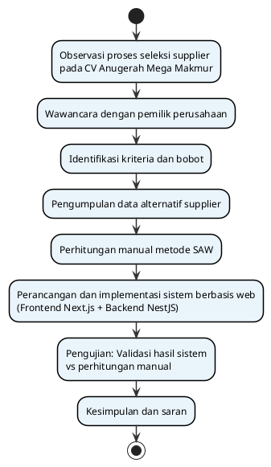
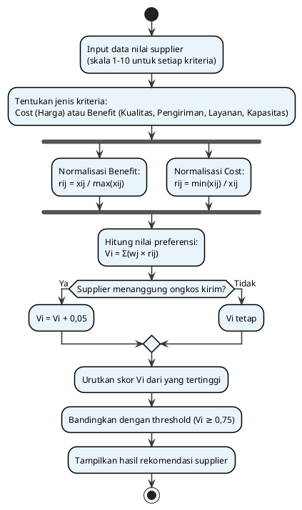
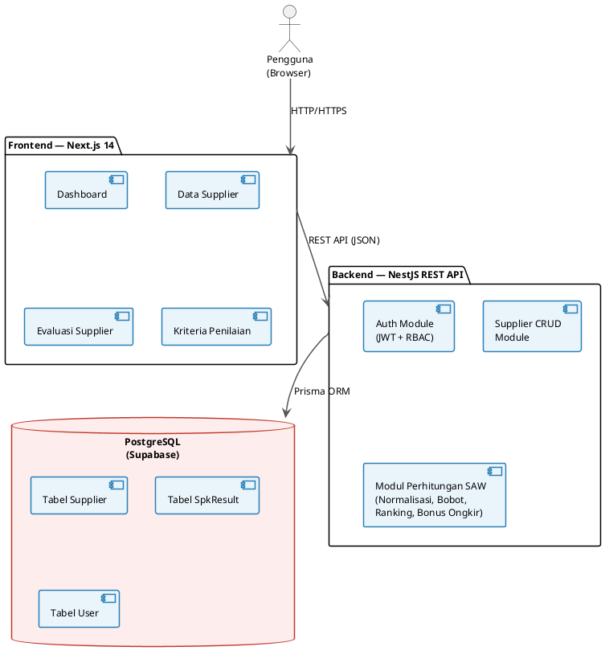

# TAMBAHAN LAPORAN — Bagian Yang Perlu Disisipkan

> File ini berisi **hanya bagian yang belum ada** di Draf_Laporan.md.
> Sisipkan konten di bawah ke lokasi yang ditandai pada dokumen Word Anda.

---

## ═══════════════════════════════════════════════════
## TAMBAHAN 1 — DAFTAR TABEL (sisipkan setelah "DAFTAR ISI")
## ═══════════════════════════════════════════════════

**DAFTAR TABEL**

| Nomor Tabel | Judul | Halaman |
|---|---|---|
| Tabel 2.1 | Kriteria dan Bobot Penilaian Supplier | 12 |
| Tabel 2.2 | Data Nilai Alternatif Supplier | 13 |
| Tabel 2.3 | Konversi Nilai ke Skala 0–1 | 14 |
| Tabel 2.4 | Nilai Minimum dan Maksimum per Kriteria | 14 |
| Tabel 2.5 | Matriks Normalisasi (rij) | 15 |
| Tabel 2.6 | Perhitungan Nilai Preferensi (Vi) | 15 |
| Tabel 2.7 | Perankingan Supplier | 16 |
| Tabel 2.8 | Perbandingan Hasil Perhitungan Manual dan Sistem | 17 |

**DAFTAR GAMBAR**

| Nomor Gambar | Judul | Halaman |
|---|---|---|
| Gambar 1.1 | Alur Penelitian | 8 |
| Gambar 2.1 | Alur Perhitungan Metode SAW | 11 |
| Gambar 2.2 | Arsitektur Sistem | 16 |
| Gambar 2.3 | Tampilan Dashboard Sistem | 17 |
| Gambar 2.4 | Tampilan Halaman Data Supplier | 17 |
| Gambar 2.5 | Tampilan Halaman Evaluasi Supplier | 18 |

---

## ═══════════════════════════════════════════════════
## TAMBAHAN 2 — GAMBAR 1.1 ALUR PENELITIAN
## (sisipkan di akhir sub-bab 1.6 Metode Penelitian)
## ═══════════════════════════════════════════════════

**Gambar 1.1 Alur Penelitian**



Sumber: Diolah oleh peneliti (2026)

---

## ═══════════════════════════════════════════════════
## TAMBAHAN 3 — RUMUS SAW YANG EKSPLISIT
## (sisipkan di sub-bab 2.2.2, gantikan paragraf deskriptif
##  yang saat ini tidak menampilkan rumus)
## ═══════════════════════════════════════════════════

### 2.2.2 Metode Simple Additive Weighting (SAW)

Simple Additive Weighting (SAW) merupakan salah satu metode dalam Multi-Attribute Decision Making (MADM). Metode ini dikenal sebagai metode penjumlahan terbobot karena proses penilaiannya dilakukan dengan menjumlahkan hasil perkalian antara bobot kriteria dan nilai rating kinerja setiap alternatif. Alternatif dengan nilai preferensi tertinggi dianggap sebagai alternatif terbaik.

Metode SAW memerlukan proses normalisasi matriks keputusan agar nilai dari setiap kriteria berada pada skala yang sebanding. Normalisasi dilakukan berdasarkan jenis kriteria, yaitu kriteria **benefit** dan kriteria **cost**.

**a) Rumus Normalisasi Kriteria Benefit**

Kriteria benefit adalah kriteria yang semakin besar nilainya maka semakin baik (Kualitas, Pengiriman, Layanan, Kapasitas).

```
        xij
rij = ───────
      max(xij)
```

**b) Rumus Normalisasi Kriteria Cost**

Kriteria cost adalah kriteria yang semakin kecil nilainya maka semakin baik (Harga).

```
      min(xij)
rij = ─────────
          xij
```

**Keterangan:**

| Simbol | Keterangan |
|---|---|
| rij | Nilai rating kinerja ternormalisasi alternatif ke-i pada kriteria ke-j |
| xij | Nilai alternatif ke-i pada kriteria ke-j |
| max(xij) | Nilai terbesar pada kriteria ke-j |
| min(xij) | Nilai terkecil pada kriteria ke-j |

**c) Rumus Nilai Preferensi (Skor Akhir)**

Setelah proses normalisasi selesai, nilai preferensi setiap alternatif dihitung dengan rumus:

```
Vi = Σ (wj × rij)
```

**d) Rumus Akhir dengan Bonus Ongkos Kirim**

Pada penelitian ini, sistem menambahkan bonus sebesar 0,05 untuk supplier yang menanggung ongkos kirim, sehingga rumus akhirnya adalah:

```
Vi = Σ (wj × rij) + Bi
```

**Keterangan:**

| Simbol | Keterangan |
|---|---|
| Vi | Nilai preferensi (skor akhir) alternatif ke-i |
| wj | Bobot kriteria ke-j |
| rij | Nilai rating kinerja ternormalisasi alternatif ke-i pada kriteria ke-j |
| Σ | Penjumlahan seluruh kriteria |
| Bi | Bonus ongkos kirim: bernilai 0,05 jika supplier menanggung ongkir, bernilai 0 jika tidak |

Supplier dinyatakan **Direkomendasikan** apabila Vi ≥ 0,75, dan **Tidak Direkomendasikan** apabila Vi < 0,75. Nilai threshold 0,75 dipilih sebagai batas kelayakan awal berdasarkan hasil wawancara dengan pemilik CV Anugerah Mega Makmur dan dapat disesuaikan sesuai kebutuhan perusahaan.

**Gambar 2.1 Alur Perhitungan Metode SAW**



Sumber: Diadaptasi dari Kusumadewi dkk. (2006)

---

## ═══════════════════════════════════════════════════
## TAMBAHAN 4 — TABEL MATRIKS NORMALISASI (rij)
## (sisipkan sebagai Tabel 2.5, setelah Tabel 2.4
##  "Nilai Minimum dan Maksimum" di sub-bab 2.4.2)
## ═══════════════════════════════════════════════════

Setelah nilai minimum dan maksimum diketahui, langkah selanjutnya adalah menormalisasi setiap nilai alternatif menggunakan rumus SAW. Hasil normalisasi ditampilkan pada Tabel 2.5 berikut.

**Tabel 2.5 Matriks Normalisasi (rij)**

| Alternatif | Harga (Cost) | Kualitas (Benefit) | Pengiriman (Benefit) | Layanan (Benefit) | Kapasitas (Benefit) |
|---|---|---|---|---|---|
| Pontianak Mobile Grosir | 0,80/0,91 = **0,8791** | 0,90/0,95 = **0,9474** | 0,88/0,92 = **0,9565** | 0,86/0,89 = **0,9663** | 0,92/0,92 = **1,0000** |
| Khatulistiwa Gadget Supply | 0,80/0,86 = **0,9302** | 0,93/0,95 = **0,9789** | 0,90/0,92 = **0,9783** | 0,89/0,89 = **1,0000** | 0,88/0,92 = **0,9565** |
| Borneo Tech Distributor | 0,80/0,82 = **0,9756** | 0,95/0,95 = **1,0000** | 0,84/0,92 = **0,9130** | 0,88/0,89 = **0,9888** | 0,86/0,92 = **0,9348** |
| Mega Jaya Cellular | 0,80/0,89 = **0,8989** | 0,88/0,95 = **0,9263** | 0,92/0,92 = **1,0000** | 0,87/0,89 = **0,9775** | 0,89/0,92 = **0,9674** |
| JBL Audio Partner | 0,80/0,80 = **1,0000** | 0,94/0,95 = **0,9895** | 0,83/0,92 = **0,9022** | 0,87/0,89 = **0,9775** | 0,82/0,92 = **0,8913** |

Keterangan: Untuk Harga (kriteria cost): rij = min(xij) / xij = 0,80 / xij. Untuk kriteria benefit: rij = xij / max(xij).

Sumber: Diolah oleh peneliti (2026)

---

## ═══════════════════════════════════════════════════
## TAMBAHAN 5 — ARSITEKTUR SISTEM
## (sisipkan sebagai sub-bab baru 2.5.1 di dalam
##  sub-bab 2.5 Implementasi Sistem)
## ═══════════════════════════════════════════════════

### 2.5.1 Arsitektur Sistem

Sistem pendukung keputusan seleksi supplier dibangun menggunakan arsitektur tiga lapis yang terdiri dari lapisan antarmuka pengguna (frontend), lapisan logika bisnis (backend), dan lapisan penyimpanan data (database). Pengguna mengakses sistem melalui browser web tanpa perlu menginstal perangkat lunak tambahan.

**Gambar 2.2 Arsitektur Sistem**



Sumber: Diolah oleh peneliti (2026)

Teknologi yang digunakan dalam pembangunan sistem adalah sebagai berikut:

| Layer | Teknologi |
|---|---|
| Frontend | Next.js 14, React, Tailwind CSS, shadcn/ui |
| Backend | NestJS, REST API, Passport JWT |
| ORM | Prisma |
| Database | PostgreSQL (dihosting di Supabase) |
| Deployment | Render (backend), Vercel/Render (frontend) |

### 2.5.2 Tampilan Antarmuka Sistem

Berikut adalah tampilan antarmuka sistem pendukung keputusan seleksi supplier yang telah diimplementasikan.

**[SISIPKAN SCREENSHOT DASHBOARD DI SINI — Gambar 2.3]**

> Petunjuk: Buka sistem di browser, ambil screenshot halaman Dashboard, simpan sebagai `gambar-dashboard.png`, lalu sisipkan di sini dengan keterangan "Gambar 2.3 Tampilan Dashboard Sistem"

**[SISIPKAN SCREENSHOT HALAMAN DATA SUPPLIER DI SINI — Gambar 2.4]**

> Petunjuk: Screenshot halaman `/suppliers`, simpan sebagai `gambar-data-supplier.png`, sisipkan dengan keterangan "Gambar 2.4 Tampilan Halaman Data Supplier"

**[SISIPKAN SCREENSHOT HALAMAN EVALUASI DI SINI — Gambar 2.5]**

> Petunjuk: Screenshot halaman `/spk` (Evaluasi Supplier), simpan sebagai `gambar-evaluasi.png`, sisipkan dengan keterangan "Gambar 2.5 Tampilan Halaman Evaluasi Supplier"

---

## ═══════════════════════════════════════════════════
## TAMBAHAN 6 — DAFTAR PUSTAKA LENGKAP
## (gantikan Daftar Pustaka yang hanya 4 referensi)
## ═══════════════════════════════════════════════════

**DAFTAR PUSTAKA**

Afshari, A., Mojahed, M., & Yusuff, R. M. (2010). Simple Additive Weighting approach to personnel selection problem. *International Journal of Innovation, Management and Technology*, 1(5), 511–515.

Fishburn, P. C. (1967). *Additive Utilities with Incomplete Product Set: Applications to Priorities and Assignments*. Baltimore: Johns Hopkins Press.

Keen, P. G. W., & Scott Morton, M. S. (1978). *Decision Support Systems: An Organizational Perspective*. Reading, MA: Addison-Wesley.

Kusumadewi, S., Hartati, S., Harjoko, A., & Wardoyo, R. (2006). *Fuzzy Multi-Attribute Decision Making (Fuzzy MADM)*. Yogyakarta: Graha Ilmu.

NestJS. (2026). *NestJS Documentation*. Diakses dari https://docs.nestjs.com/

Next.js. (2026). *Next.js Documentation*. Diakses dari https://nextjs.org/docs

PostgreSQL Global Development Group. (2026). *PostgreSQL Documentation*. Diakses dari https://www.postgresql.org/docs/

Prisma. (2026). *Prisma Documentation*. Diakses dari https://www.prisma.io/docs

Suryadi, K., & Ramdhani, M. A. (2000). *Sistem Pendukung Keputusan: Suatu Wacana Struktural Idealisasi dan Implementasi Konsep Pengambilan Keputusan*. Bandung: PT Remaja Rosdakarya.

Turban, E., Aronson, J. E., & Liang, T. P. (2005). *Decision Support Systems and Intelligent Systems* (7th ed.). Upper Saddle River, NJ: Pearson Prentice Hall.

Triantaphyllou, E. (2000). *Multi-Criteria Decision Making Methods: A Comparative Study*. Dordrecht: Springer.

Zeleny, M. (1982). *Multiple Criteria Decision Making*. New York: McGraw-Hill.

---

## ═══════════════════════════════════════════════════
## CATATAN PENOMORAN BAB (perbaikan format)
## ═══════════════════════════════════════════════════

Pada dokumen Word, pastikan judul bab dan sub-bab menggunakan format berikut:

| Format Sekarang (Salah) | Format Seharusnya (Benar) |
|---|---|
| `# PENDAHULUAN` | `BAB I PENDAHULUAN` |
| `## Latar Belakang` | `1.1 Latar Belakang` |
| `## Rumusan Masalah` | `1.2 Rumusan Masalah` |
| `## Tujuan Penelitian` | `1.3 Tujuan Penelitian` |
| `## Batasan Masalah` | `1.4 Batasan Masalah` |
| `## Manfaat Penelitian` | `1.5 Manfaat Penelitian` |
| `## Metode Penelitian` | `1.6 Metode Penelitian` |
| `# PEMBAHASAN` | `BAB II PEMBAHASAN` |
| `## Profil CV...` | `2.1 Profil CV Anugerah Mega Makmur` |
| `## Landasan Teori` | `2.2 Landasan Teori` |
| `### Sistem Pendukung Keputusan` | `2.2.1 Sistem Pendukung Keputusan` |
| `### Metode SAW` | `2.2.2 Metode Simple Additive Weighting (SAW)` |
| `## Identifikasi Kriteria...` | `2.3 Identifikasi Kriteria dan Bobot` |
| `## Perhitungan Manual...` | `2.4 Perhitungan Manual Metode SAW` |
| `## Implementasi Sistem` | `2.5 Implementasi Sistem` |
| `## Perbandingan Hasil...` | `2.6 Perbandingan Hasil Manual dan Web` |
| `## Dokumentasi Observasi...` | `2.7 Dokumentasi Observasi dan Wawancara` |
| `# PENUTUP` | `BAB III PENUTUP` |
| `## Kesimpulan` | `3.1 Kesimpulan` |
| `## Future Works` | `3.2 Saran` |


@startuml
skinparam defaultFontName "Times New Roman"
skinparam shadowing false
skinparam backgroundColor white
skinparam rectangle {
    BorderColor black
    BackgroundColor white
}
skinparam ArrowColor black

actor "Pengguna" as User
rectangle "Frontend\nNext.js" as FE
rectangle "Backend\nNestJS REST API" as BE
rectangle "Prisma ORM" as ORM
database "Database\nPostgreSQL" as DB

User --> FE
FE --> BE
BE --> ORM
ORM --> DB

@enduml